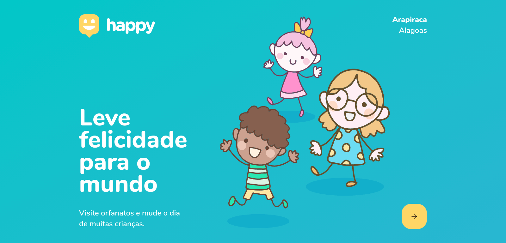

# Happy: Next Level Week 3 - Front-end.



<p align="center">
  <a href="#rocket-objective">Objetivo</a>&nbsp;&nbsp;&nbsp;|&nbsp;&nbsp;&nbsp;
  <a href="#rocket-technologies">Tecnologias</a>&nbsp;&nbsp;&nbsp;|&nbsp;&nbsp;&nbsp;
  <a href="#information_source-how-to-use">Como Executar?</a>&nbsp;&nbsp;&nbsp;
</p>

## :information_source: Objetivo

Happy é uma plataforma que permite aos usuários consultarem e cadastrarem os orfanatos de suas respectivas regiões.

## :rocket: Tecnologias

Foram utilizadas as seguintes tecnologias no mesmo:

- Reactjs
- Typescript
- Axios
- React Router Dom
- React Icons
- React Leaflet
- Mapbox API.

## :information_source: Como executar?

Para clonar o diretório é necessário ter o git instalado.

```bash
# Clone this repository
$ git clone https://github.com/glaubersabino/nlw-rocketseat-3

# Go into the repository
$ cd nlw-rocketseat-3

# Install dependencies
$ yarn

# Run the api
$ yarn start
```